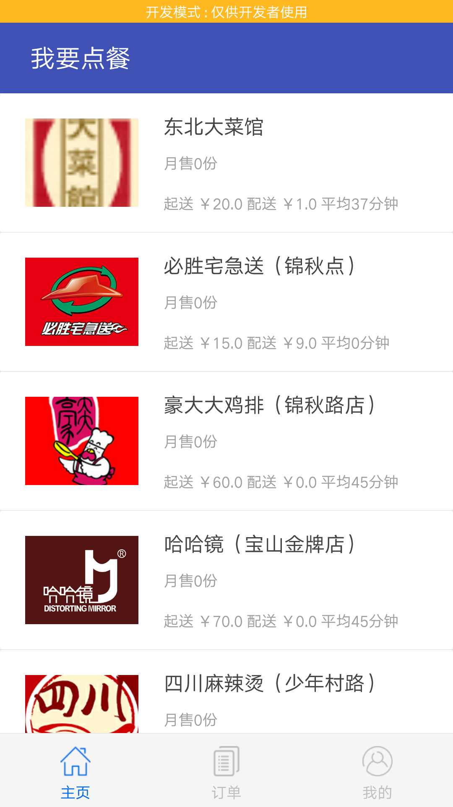
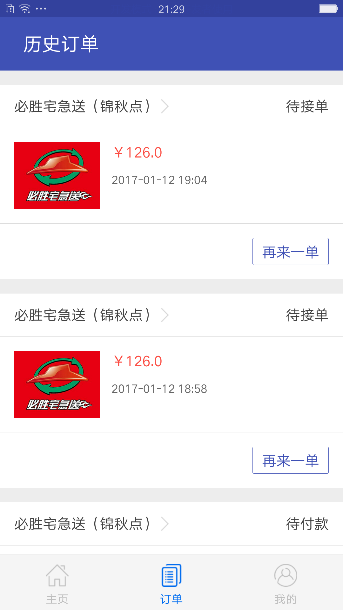
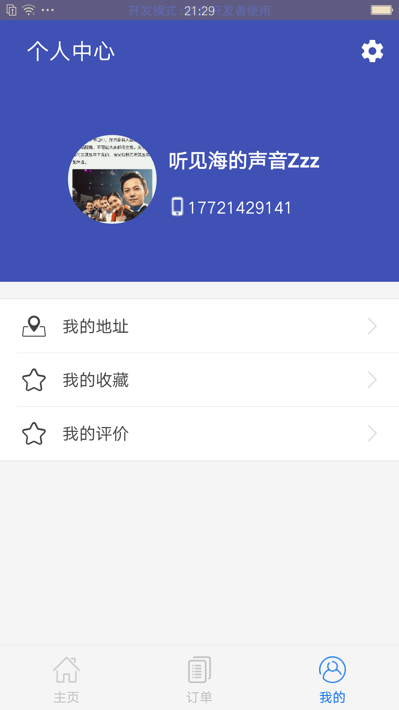
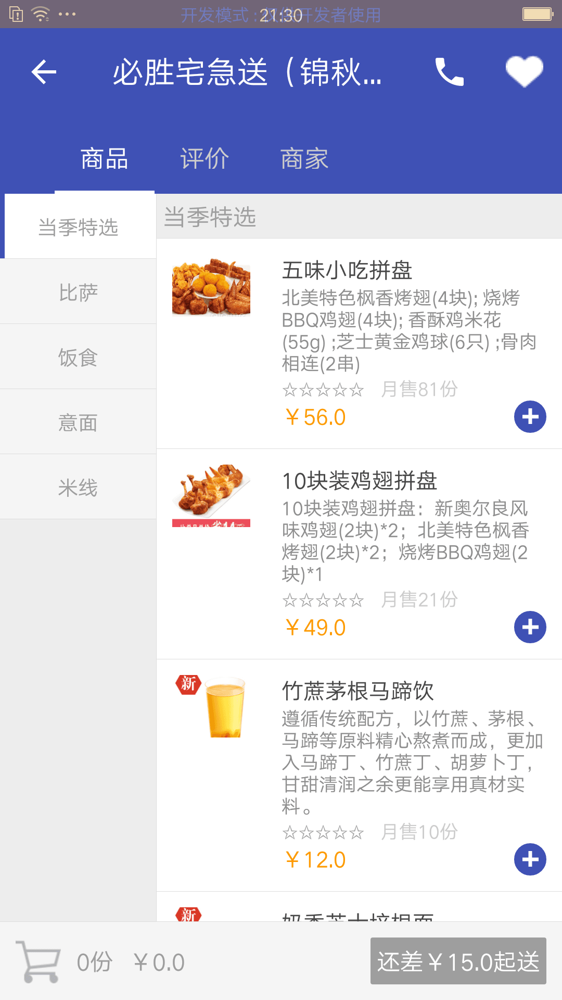
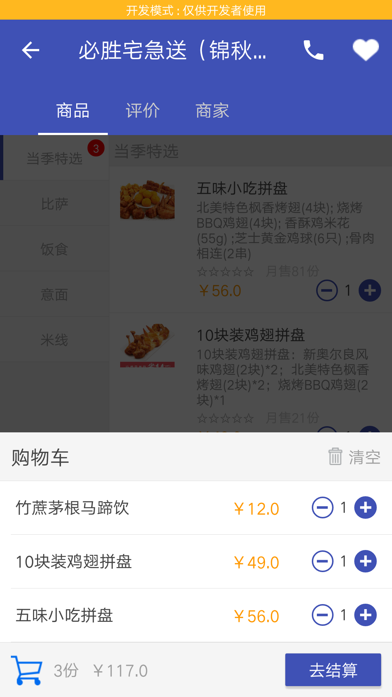
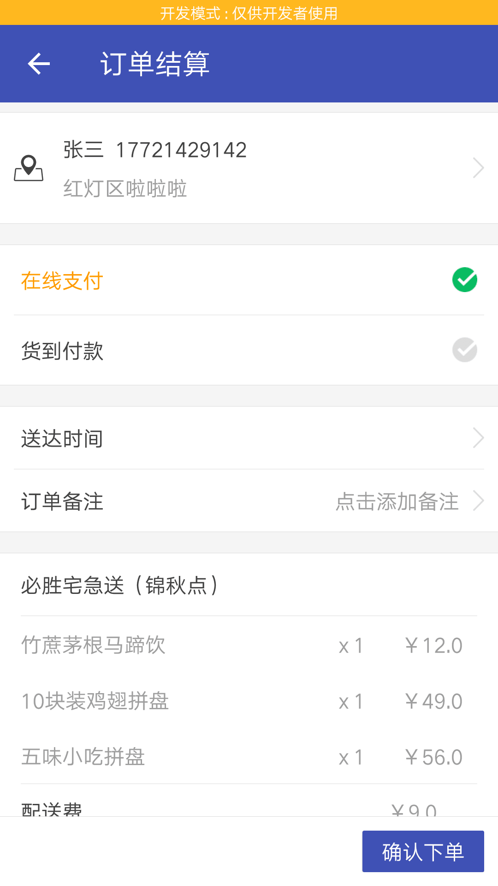
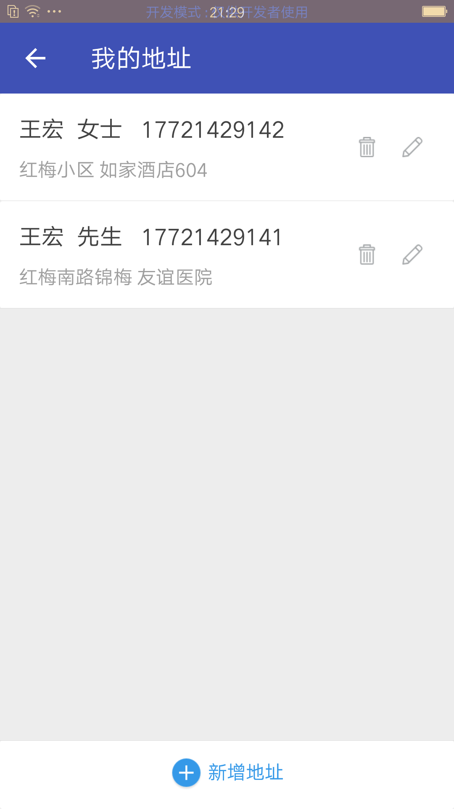
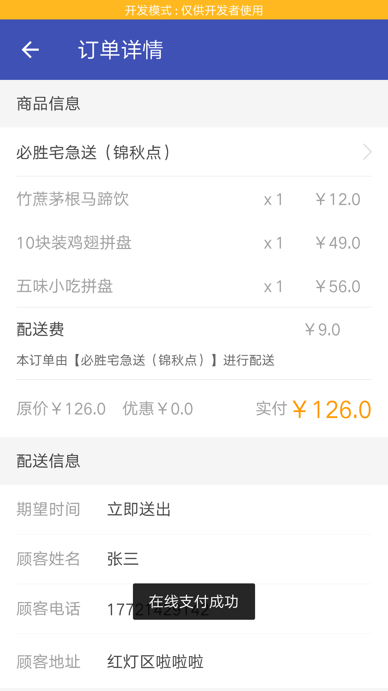

## 相关项目

* [LazyWaimai-Web](https://github.com/cheikh-wang/LazyWaimai-Web) by [@Cheikh](https://github.com/cheikh-wang)
* [LazyWaimai-Api](https://github.com/cheikh-wang/LazyWaimai-Api) by [@Cheikh](https://github.com/cheikh-wang)

## 项目介绍

　　这个项目是我今年5月份参加毕业答辩时做的项目，包含Web商家端和Android客户端，以及API服务端，是我花了大半年的时间做出来的，是我的心血，目前还有一些小功能还没做完，但整体流程已经差不多了，现在我整理了下代码，分享出来，如果你觉得对你有帮助，请打个star鼓励一下我吧！

　　此项目的架构采用MVP模式，但不是传统的MVP模式，是我从Google大神 Chirs Banes 做的 [philm](https://github.com/chrisbanes/philm) 项目中提取出来的。功能、界面是我对照着市场上的外卖APP（饿了么、美团外卖、百度外卖）模仿着实现的，图片资源是从网上以及其他APP里提取出来的，如果有侵权，请联系我删除，谢谢！

## 运行截图

## 安装方式
1、在指定的目录下执行

> git clone https://github.com/cheikh-wang/LazyWaimai-Android

2、将项目导入 Android Studio 运行即可

###License
<pre>
Copyright 2015 Cheikh

Licensed under the Apache License, Version 2.0 (the "License");
you may not use this file except in compliance with the License.
You may obtain a copy of the License at

   http://www.apache.org/licenses/LICENSE-2.0

Unless required by applicable law or agreed to in writing, software
distributed under the License is distributed on an "AS IS" BASIS,
WITHOUT WARRANTIES OR CONDITIONS OF ANY KIND, either express or implied.
See the License for the specific language governing permissions and
limitations under the License.
</pre>